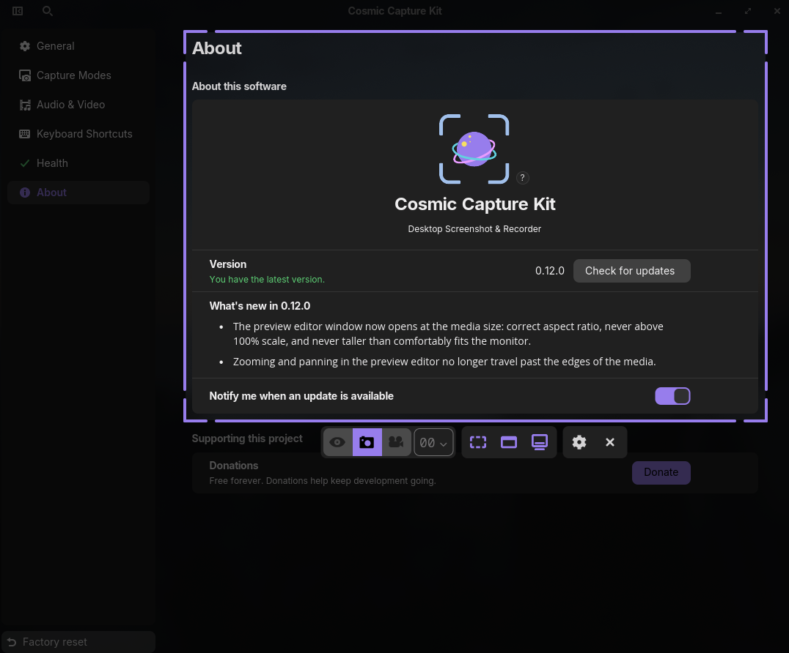

# Cosmic Capture Kit



Native screenshot, screen-recording, and scanner tool for COSMIC-based Linux
desktops and macOS. Select a region, window, or monitor from a fullscreen
overlay; capture a still or record video with mic + system audio; touch it up
in the post-capture editor (covermark, timeline cuts); or scan QR codes,
barcodes, and text (OCR) straight off the screen. Built in Rust on
libcosmic/iced.

Deeper docs: [architecture](docs/ARCHITECTURE.md), [CLI flags](CLI.md).

## Supported platforms

| Platform | Capture backend | Status |
|---|---|---|
| Linux: COSMIC | Native compositor screencopy (ext-image-copy-capture) | Supported |
| Linux: Sway 1.10+ / Hyprland / River (wlroots) | Native screencopy via the same protocol probe | Should work, lightly tested |
| Linux: KDE Plasma | PipeWire portal | Basic (portal picker dialogs, fewer capture extras) |
| Linux: GNOME | PipeWire portal | Basic (portal picker dialogs, fewer capture extras) |
| macOS 13+ | ScreenCaptureKit | Supported |
| Windows | (planned) | Coming soon |

Support is probed by protocol at launch, not by desktop name; Settings >
Health shows exactly what your environment offers.

## Installation

### macOS

1. Download the latest `.dmg` from
   [Releases](https://github.com/Frosthaven/cosmic-capture-kit/releases) and
   drag the app to Applications.
2. First launch: grant Screen Recording (System Settings > Privacy &
   Security), then relaunch. Microphone is optional (for recordings with mic).
3. Updating: the app checks automatically and installs new versions in one
   click from Settings > About.

Homebrew: coming soon.

### Linux

Build from source for now (packaged channels are on the way):

```sh
git clone https://github.com/Frosthaven/cosmic-capture-kit
cd cosmic-capture-kit
cargo build --release
```

The default GPU zero-copy feature needs ffmpeg 8 headers (Arch, CachyOS,
recent Fedora); on older-ffmpeg distros build with
`--no-default-features` (recording still works through the `ffmpeg` binary).
Runtime dependencies: `ffmpeg` (screen recording), `tesseract` (OCR,
optional).

Install the desktop entry + icon, then point a keybind at the binary (COSMIC:
Settings > Input Devices > Keyboard > Shortcuts > Custom). Flags like
`--window --video`, `--scan`, and `--settings` make one-press flows; see
[CLI.md](CLI.md).

```sh
install -Dm644 res/dev.frosthaven.CosmicCaptureKit.desktop \
  ~/.local/share/applications/dev.frosthaven.CosmicCaptureKit.desktop
install -Dm644 res/icons/dev.frosthaven.CosmicCaptureKit.svg \
  ~/.local/share/icons/hicolor/scalable/apps/dev.frosthaven.CosmicCaptureKit.svg
```

Updating: `git pull` and rebuild; the in-app update check links to the
releases page on Linux.

AUR: coming soon. Flathub: coming soon.

### Windows

Coming soon. The per-platform plugin scaffold is in place
(`src/platform/windows/`).

---

## License

The source code in this repository is licensed under
[GPL-3.0-only](LICENSE). The Linux app is free software: use it, build it,
share it — it's free forever. If it's useful to you, donations via
[PayPal](https://paypal.me/Frosthaven) are
appreciated but never required.

Official macOS and Windows releases are paid, separately licensed binary
builds by the copyright holder. (The author holds the copyright to all code
in this repository and additionally licenses their own code to themselves
for those proprietary builds; the GPL grant above applies to everyone else
and to this repository's contents.)

**Contributions:** by submitting a contribution you agree to license it
under GPL-3.0-only *and* grant the maintainer the right to include it in
the proprietary macOS/Windows builds. If you don't want that, please open
an issue instead of a PR.

Icon by [Ashley Ball](https://ashleythedesigner.com/); embedded icon licensing
lives in [res/icons/ATTRIBUTION.md](res/icons/ATTRIBUTION.md).
