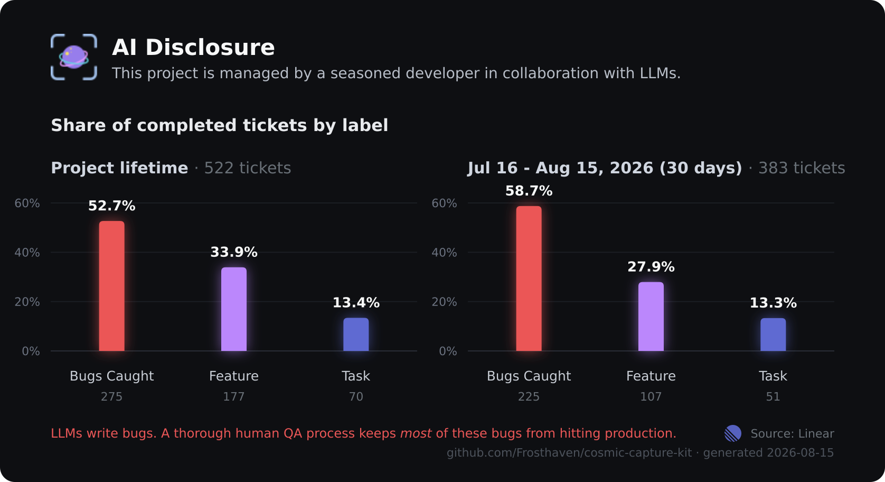

# Cosmic Capture Kit

<!-- cck-disclosure-start -->

<!-- cck-disclosure-end -->

---


Quickly capture your screen/audio to the clipboard for sharing with others.
Supports QR/barcode/OCR scanning, a screen color picker, cloud upload with
automatic sharing links, and post-capture annotations.

## 📊 Current Support Status

### Supported Platforms

**Legend:** ✅ supported · 🟡 partial · ❌ not supported · 📅 planned · ❓ unknown until built

| Platform                  | Compositor                                  | Common distros                       | Capture method           | Core features | Capture extras | Window aesthetics |
| ------------------------- | ------------------------------------------- | ------------------------------------ | ------------------------ | ------------- | -------------- | ----------------- |
| macOS 14+ (Apple Silicon) | Quartz Compositor                           | macOS                                | ScreenCaptureKit         | ✅            | ✅             | ✅                |
| Windows 10, 11 (x86_64)   | Desktop Window Manager                      | Windows                              | Windows Graphics Capture | ✅            | ✅             | ✅                |
| Linux, Wayland            | cosmic-comp (COSMIC)                        | Pop!_OS                              | screencopy / portal      | ✅            | ✅             | ✅                |
| Linux, Wayland            | KWin 6.6+ (KDE Plasma)                      | Kubuntu, Fedora KDE, SteamOS Desktop | screencopy / portal      | 📅            | ❓             | ❓                |
| Linux, Wayland            | Mutter 49.2+ (GNOME)                        | Ubuntu, Fedora, Debian               | screencopy / portal      | 📅            | ❓             | ❓                |
| Linux, Wayland            | Muffin 6.6+ (Cinnamon)                      | Linux Mint                           | screencopy / portal      | 📅            | ❓             | ❓                |
| Linux, Wayland            | Hyprland 0.52+                              | *user installed*                     | screencopy / portal      | 📅            | ❓             | ❓                |
| Linux, Wayland            | niri 25.11+                                 | *user installed*                     | screencopy / portal      | 📅            | ❓             | ❓                |
| Linux, Wayland            | wlroots 0.19+ (Sway, river, Wayfire, labwc) | *user installed*                     | screencopy / portal      | 📅            | ❓             | ❓                |
| Linux, X11                | any window manager                          | Mint MATE / Xfce, older releases     | X11 XShm                 | 📅            | ❓             | ❓                |

<details>
<summary>What these columns mean, and what's required</summary>

Sway, river, Wayfire and labwc share a row because they are all built on
wlroots, which implements these protocols on their behalf. Each version above is
simply that compositor's first release carrying wlroots 0.19 or newer, which is
where the capture protocols landed. Hyprland and niri implement their own
protocol support (on Aquamarine and Smithay respectively), so they get their own
rows.

**Capture extras** are the four capture-time options: freeze pixels during
selection, preserve mouse cursor, preserve window transparency, and preserve
wallpaper. Some of them need platform-specific functionality: on macOS, for
example, capturing windows with their glass effects is not possible through the
available APIs, so clever recompositing is required.

**Window aesthetics** is the border, shadow, rounding and padding applied to a
captured single window.

Whatever your own system supports is reported under Settings -> Health.

On Linux the two capture methods are **Compositor screencopy**, which reads
frames straight from the compositor, and the **PipeWire portal**, which asks
permission through a system dialog. Both appear in Settings under Capture
method; the version floors above are where each compositor gained the protocols
screencopy needs.

On X11 there is no single capture API. A backend there would combine XShm for
full-screen grabs, XComposite for per-window pixels, XFixes for the cursor,
EWMH window properties for the window list, and ffmpeg's x11grab for recording.

X11 applications running inside a Wayland session capture normally: they are
ordinary windows to the compositor.

Recording needs ffmpeg, and audio capture on Linux needs a Pulse-compatible
server. See [dependencies.md](dependencies.md) for the full list and what
happens when a piece is missing.

</details>

### Supported Features

These are cross-platform features that are currently planned for the project
along with their statuses.

**Legend:** ✅ done · 📅 planned · ❓ under consideration

<details>
<summary><b>Core</b></summary>

| Feature                         | Status |
| ------------------------------- | ------ |
| Image capture                   | ✅     |
| Video capture                   | ✅     |
| Audio capture                   | ✅     |
| Audio cleanup & mixing pipeline | ✅     |
| Encoder setup & configuration   | ✅     |
| Preview editor (windowed)       | ✅     |
| Preview editor (overlay)        | ✅     |
| System tray daemon              | ✅     |
| Color picker tool               | ✅     |

</details>

<details>
<summary><b>Image Preview Editor</b></summary>

| Feature                   | Status |
| ------------------------- | ------ |
| Covermarks                | ✅     |
| Color selector            | ✅     |
| Arrows                    | ✅     |
| Highlighter               | ✅     |
| Text w/size               | ✅     |
| Step markers              | ✅     |
| Dim/spotlight             | ✅     |
| Destructive pixelate      | ✅     |
| Destructive blur          | ✅     |
| Box outline               | ✅     |
| Box fill                  | 📅     |
| Box highlight             | ✅     |
| Pencil w/line widths      | ✅     |
| Sticker tool              | 📅     |
| Eraser tool               | ✅     |
| Select/multi-select tool  | ✅     |
| Crop tool                 | ✅     |
| Automatic clipboard copy  | ✅     |
| Save (choose where)       | ✅     |
| Copy to clipboard         | ✅     |
| Share sheet (Windows)     | ✅     |
| Share sheet (macOS)       | ✅     |
| Upload to a cloud account | ✅     |

</details>

<details>
<summary><b>Video Preview Editor</b></summary>

| Feature                    | Status |
| -------------------------- | ------ |
| Simple cutting tool        | ✅     |
| Simple transition dropdown | 📅     |
| Automatic clipboard copy   | ✅     |
| Save (choose where)        | ✅     |
| Copy to clipboard          | ✅     |
| Share sheet (Windows)      | ✅     |
| Share sheet (macOS)        | ✅     |
| Upload to a cloud account  | ✅     |

</details>

<details>
<summary><b>Recording Controls</b></summary>

| Feature                 | Status |
| ----------------------- | ------ |
| Toggle mic              | ✅     |
| Toggle speaker          | ✅     |
| Pause recording         | ✅     |
| Delete/cancel recording | ✅     |
| Mouse click effects     | 📅     |
| Keypress overlay        | ❓     |
| Live annotation tools   | ❓     |

</details>

<details>
<summary><b>Cloud Accounts</b></summary>

| Feature      | Status |
| ------------ | ------ |
| Dropbox      | ✅     |
| Google Drive | ✅     |
| iCloud Drive | 📅     |
| OneDrive     | ✅     |
| Proton Drive | ✅     |
| SFTP         | 📅     |

</details>

## 📦 Installation

<details>
<summary><b>macOS</b></summary>

1. Download the latest `CosmicCaptureKit-<version>-aarch64.dmg` from
   [Releases](https://github.com/Frosthaven/cosmic-capture-kit/releases) and
   drag the app to Applications. Apple Silicon only.
2. First launch: grant Screen Recording (System Settings > Privacy &
   Security), then relaunch. Microphone is optional (for recordings with mic).

</details>

<details>
<summary><b>Windows 11</b></summary>

1. Download the latest `CosmicCaptureKit-<version>-x86_64.msi` from
   [Releases](https://github.com/Frosthaven/cosmic-capture-kit/releases) and run
   it (x86_64 only). It installs per-user (no admin prompt) to
   `%LOCALAPPDATA%\Programs\cosmic-capture-kit`, bundles ffmpeg, and adds Start
   Menu shortcuts (Cosmic Capture Kit, and Cosmic Capture Kit Settings), so
   there is nothing else to install.
2. The installer is not code-signed yet, so on first run SmartScreen may show
   "Windows protected your PC". Click More info, then Run anyway.

</details>

<details>
<summary><b>Linux (Wayland): COSMIC</b></summary>

There are three routes: the AppImage, which is the quickest and the one to take
unless you have a reason not to; the plain zip, if you would rather have a bare
binary and use your distro's own ffmpeg and tesseract; or building from source,
which works on any distro and on any architecture.

The downloads come in **x86_64** and **aarch64** builds. Take the one matching
`uname -m`; the filenames carry it. aarch64 covers Asahi on Apple Silicon,
Raspberry Pi 5 desktops and ARM laptops.

#### Download the AppImage

1. Download `CosmicCaptureKit-<arch>.AppImage` from
   [Releases](https://github.com/Frosthaven/cosmic-capture-kit/releases), where
   `<arch>` is what `uname -m` prints (`x86_64` or `aarch64`).
2. Make it executable and, if you like, put it on your `PATH`:

   ```sh
   chmod +x CosmicCaptureKit-*.AppImage
   mkdir -p ~/.local/bin && mv CosmicCaptureKit-*.AppImage ~/.local/bin/
   ```

   Every command below works the same way, so `cosmic-capture-kit --settings`
   becomes `CosmicCaptureKit-<arch>.AppImage --settings`. A symlink named
   `cosmic-capture-kit` pointing at it keeps the shorter form.

   The filename carries no version on purpose: this file updates itself in
   place, so a version in the name would be wrong as soon as the first update
   landed. Check the version in Settings, under About. Whatever path you bind a
   shortcut to keeps working forever, because updates never rename it.
3. Run it with `--settings` to look around and set your save folders, then bind
   the [shortcuts](#shortcuts) below.

The AppImage carries its own **ffmpeg 9.0 and tesseract**, so recording and
OCR work with nothing else installed, and it carries ffmpeg's libraries too, so
GPU zero-copy recording is available even on a distro whose own ffmpeg is older.
Graphics, audio and GPU drivers deliberately come from your system, since a
bundled copy could not match your driver. It needs glibc 2.34 or newer (Ubuntu
22.04, Mint 21, Pop!_OS 22.04, Debian 12 and anything newer) and, for zero-copy
recording, Mesa 21.1 or newer.

If it refuses to start with **"No suitable fusermount binary found on the
$PATH"**, install `fuse3` (that package name is the same on Arch, Debian,
Ubuntu, Fedora and openSUSE). An AppImage mounts itself to run, and while this
one carries its own copy of the FUSE library, the small `fusermount3` helper it
needs has to come from your distribution, because it must be installed with
elevated privileges. Any normal desktop already has it, pulled in by things like
your file manager or the desktop portals, so this only tends to come up on a
minimal or server install.

It is also the only Linux download that **updates itself**. Settings > About
checks for new releases and installs one in place, keeping the filename and
location you chose, so a shortcut, symlink or autostart entry pointing at it
keeps working afterwards. Put it somewhere you own, such as `~/.local/bin` or
`~/Applications`; an AppImage in a system folder like `/opt` cannot be replaced
without root, and the update will say so rather than fail quietly.

#### Download the plain zip

1. Download `CosmicCaptureKit-<version>-<arch>.zip` from
   [Releases](https://github.com/Frosthaven/cosmic-capture-kit/releases), where
   `<arch>` is what `uname -m` prints (`x86_64` or `aarch64`).
2. Unzip it and put the binary on your `PATH`:

   ```sh
   unzip CosmicCaptureKit-*.zip
   chmod +x cosmic-capture-kit
   mkdir -p ~/.local/bin && mv cosmic-capture-kit ~/.local/bin/
   ```

   If your shell cannot find it afterwards, `~/.local/bin` is not on your
   `PATH` yet.
3. Run `cosmic-capture-kit --settings` to look around and set your save
   folders, then bind the [shortcuts](#shortcuts) below.

The zip holds one binary and nothing else, so recording and OCR use your
distro's `ffmpeg` and `tesseract` packages (see
[dependencies.md](dependencies.md)). It needs glibc 2.34 or newer, the same
floor as the AppImage. It also links libxkbcommon, libpulse and libpipewire,
which a COSMIC desktop already has.

This route tells you when an update is out but does not install it: you unpacked
the binary wherever you liked, so there is no install location to replace safely.
Settings > About opens the releases page instead, and you repeat the steps above.

Google Drive, OneDrive and Dropbox need no setup in this build: their provider
registrations are already compiled in. A build from source does not have them,
and needs one one-time step per provider.

Proton Drive is different. It also needs the `proton-drive` command line tool
installed separately, which only the Flatpak bundles.

To get an entry in the application menu, install the shipped desktop file as
described in [DEVELOPERS.md](DEVELOPERS.md).

#### Build from source

Building works on any distro and any architecture, and it is the route on
architectures the releases do not cover. With Rust and
[`just`](https://github.com/casey/just) installed:

```sh
git clone https://github.com/Frosthaven/cosmic-capture-kit
cd cosmic-capture-kit
just build
```

It prints the path to the binary it made as its last line.

[DEVELOPERS.md](DEVELOPERS.md) is the full guide: the packages to install first,
the `--no-default-features` rule for distros whose ffmpeg is older than 8, how to
put the binary on your `PATH`, and what each `just` recipe does.

#### Shortcuts

Cosmic Capture Kit ships with no keybindings of its own. Add your own in
**Settings → Keyboard → Shortcuts → Custom shortcuts**.

**One key is enough.** A bare launch opens the capture overlay, and the overlay
is the whole tool. Its toolbar switches between region, window and monitor
without relaunching, and it also carries the screenshot / recording / scan
choice, the countdown, and the capture toggles. Pressing the active selector is
what takes the capture.

**`cosmic-capture-kit` below means whichever file you installed.** The tables use
the zip's binary name, but the AppImage takes exactly the same flags. Substitute
its filename and everything works identically:

```sh
cosmic-capture-kit --region                 # the zip's binary
CosmicCaptureKit-x86_64.AppImage --region   # the AppImage, same flags
```

A custom shortcut runs a command directly instead of searching your `PATH` the
way a shell does, so give the **full path** unless the file sits somewhere
already on it:

```
/home/you/.local/bin/CosmicCaptureKit-x86_64.AppImage --region
```

A symlink named `cosmic-capture-kit` pointing at the AppImage keeps the short
form in every command below, and keeps working across updates, since an update
replaces the file without renaming it.

| Command              | Suggested keys |
| -------------------- | -------------- |
| `cosmic-capture-kit` | `Print`        |

With a region drawn, `Ctrl+C` copies it to the clipboard without opening the
editor.

The rest are for landing somewhere directly, if you would rather skip the
toolbar for a mode you use constantly:

| Command                               | What it does                                    | Suggested keys |
| ------------------------------------- | ----------------------------------------------- | -------------- |
| `cosmic-capture-kit --region`         | The overlay, region selected (same as bare)      | `Alt+Shift+1`  |
| `cosmic-capture-kit --window`         | The overlay, window selected                     | `Alt+Shift+2`  |
| `cosmic-capture-kit --monitor`        | The overlay, monitor selected                    | `Alt+Shift+3`  |
| `cosmic-capture-kit --active-window`  | Captures the active window at once, no overlay   | `Alt+Shift+4`  |
| `cosmic-capture-kit --active-monitor` | Captures the monitor under the cursor, no overlay | `Alt+Shift+5` |
| `cosmic-capture-kit --color-picker`   | Picks a color off the screen (magnifier overlay)  | `Alt+Shift+C` |

The two `--active-*` commands are not available when the app runs as a Flatpak: a
sandboxed app cannot ask the compositor which window or monitor is active.

Add `--no-editor` to any of these for a variant that skips the preview editor:
the capture is saved, copied to the clipboard and notified, with no editor to
dismiss. The notification names what it captured, and clicking it opens the
folder with the file selected. Bind both variants of a mode and pick per
keypress:

| Command                                           | Suggested keys |
| ------------------------------------------------- | -------------- |
| `cosmic-capture-kit --no-editor`                  | `Alt+Shift+6`  |
| `cosmic-capture-kit --active-window --no-editor`  | `Alt+Shift+7`  |
| `cosmic-capture-kit --active-monitor --no-editor` | `Alt+Shift+8`  |

**Controlling a recording that is already running.** These are shortcuts too,
bound the same way, but they do not launch anything: each one reaches the
recording in progress and acts on it.

| Command                                    | What it does                            | Suggested keys |
| ------------------------------------------ | --------------------------------------- | -------------- |
| `cosmic-capture-kit --pause-recording`     | Pauses the recording, or resumes it      | `Alt+Shift+P`  |
| `cosmic-capture-kit --finish-recording`    | Finishes the recording and saves it      | `Alt+Shift+Enter` |
| `cosmic-capture-kit --cancel-recording`    | Cancels the recording and deletes it     | `Alt+Shift+Backspace` |
| `cosmic-capture-kit --toggle-mic`          | Toggles the microphone                   | `Alt+Shift+M`  |
| `cosmic-capture-kit --toggle-system-audio` | Toggles system audio                     | `Alt+Shift+S`  |

They have to be desktop shortcuts rather than shortcuts inside the app. Once a
recording starts, the app hands the keyboard back to the window you are
recording, so that you can keep typing into it, and COSMIC's desktop portal has
no way to give an app a shortcut that works without focus. A shortcut in your own
keyboard settings has neither problem. The app's Settings → Keyboard Shortcuts
page shows these five commands for the same reason, instead of key bindings it
could not honour.

With no recording in progress, the command prints `no recording is in progress`
and does nothing.

See [CLI.md](CLI.md) for every flag, including `--video`, `--audio`, `--scan`
and `--countdown`.

#### Dependencies

| Library     | Required | Notes                                                                           |
| ----------- | -------- | ------------------------------------------------------------------------------- |
| `ffmpeg`    | Yes      | If you have `ffmpeg` 8 headers, you can take advantage of zero-copy recordings. |
| `tesseract` | No       | Enables OCR support in the scanner (don't forget to install a language pack).   |

</details>

---

## 🧩 Tiling window managers

Cosmic Capture Kit makes an effort to play nicely with popular tiling window
managers. The overlay tools will bypass tiling, while the preview editor, the
settings window, the color picker's result window, and (macOS only) the
permission checker window will not by default. You can change this behavior
using the information below.

* Settings window: title `Cosmic Capture Kit - Settings`
* Preview editor window: title `Cosmic Capture Kit - Preview Editor`
* Color picker window: title `Cosmic Capture Kit - Color Picker`
* Permission checker window (macOS only): title `Cosmic Capture Kit - Permissions`
* All four share application id `dev.thedragon.CosmicCaptureKit`

Each snippet below is an addition to your existing config, not a replacement
for it.

### macOS

<details>
<summary><b>AeroSpace</b></summary>

```
~/.config/aerospace/aerospace.toml
```

```toml
[[on-window-detected]]
if.window-title-regex-substring = 'Cosmic Capture Kit - Settings'
run = ['layout floating']

[[on-window-detected]]
if.window-title-regex-substring = 'Cosmic Capture Kit - Preview Editor'
run = ['layout floating']

[[on-window-detected]]
if.window-title-regex-substring = 'Cosmic Capture Kit - Color Picker'
run = ['layout floating']

[[on-window-detected]]
if.window-title-regex-substring = 'Cosmic Capture Kit - Permissions'
run = ['layout floating']
```

Reload with `aerospace reload-config`. The match is an unanchored, case
insensitive substring.

</details>

<details>
<summary><b>yabai</b></summary>

```
~/.config/yabai/yabairc
```

```sh
yabai -m rule --add app="^Cosmic Capture Kit$" title="^Cosmic Capture Kit - Settings$" manage=off
yabai -m rule --add app="^Cosmic Capture Kit$" title="^Cosmic Capture Kit - Preview Editor$" manage=off
yabai -m rule --add app="^Cosmic Capture Kit$" title="^Cosmic Capture Kit - Color Picker$" manage=off
yabai -m rule --add app="^Cosmic Capture Kit$" title="^Cosmic Capture Kit - Permissions$" manage=off
```

The regex is POSIX extended and unanchored, hence the `^` and `$`. `app` matches
the application name, not the bundle id. Rules apply to windows opened
afterwards, so run `yabai -m rule --apply` to catch windows that are already
open. `manage` needs no SIP changes.

</details>

### Windows

<details>
<summary><b>GlazeWM</b></summary>

```
%USERPROFILE%\.glzr\glazewm\config.yaml
```

```yaml
window_rules:
  - commands: ["set-floating"]
    match:
      - window_title: { equals: "Cosmic Capture Kit - Settings" }
      - window_title: { equals: "Cosmic Capture Kit - Preview Editor" }
      - window_title: { equals: "Cosmic Capture Kit - Color Picker" }
```

This is the v3 config format. Reload with `wm-reload-config` (`alt+shift+r` by
default). Each `- ` entry under `match` is an alternative, so the three titles are
an either/or.

</details>

<details>
<summary><b>komorebi</b></summary>

```
%USERPROFILE%\komorebi.json
```

Merge this key into your existing `komorebi.json`; it is not the whole file:

```json
{
  "floating_applications": [
    { "kind": "Title", "id": "Cosmic Capture Kit - Settings", "matching_strategy": "Equals" },
    { "kind": "Title", "id": "Cosmic Capture Kit - Preview Editor", "matching_strategy": "Equals" },
    { "kind": "Title", "id": "Cosmic Capture Kit - Color Picker", "matching_strategy": "Equals" }
  ]
}
```

Apply it with `komorebic replace-configuration <path>`. Note that
`komorebic reload-configuration` is for the legacy `komorebi.ahk` and
`komorebi.ps1` configs and will not pick this up.

</details>

### Linux

<details>
<summary><b>COSMIC desktop</b></summary>

```
~/.config/cosmic/com.system76.CosmicSettings.WindowRules/v1/tiling_exception_custom
```

```
[
  (enabled: true, appid: "dev.thedragon.CosmicCaptureKit", title: "Cosmic Capture Kit - Settings"),
  (enabled: true, appid: "dev.thedragon.CosmicCaptureKit", title: "Cosmic Capture Kit - Preview Editor"),
  (enabled: true, appid: "dev.thedragon.CosmicCaptureKit", title: "Cosmic Capture Kit - Color Picker"),
]
```

All three fields are required. No compositor restart is needed, but the rule is
read when a window opens, so reopen the window rather than restarting. Do not
hand-edit this file while the Settings app is open, since it will write over you.

</details>

<details>
<summary><b>Hyprland</b></summary>

Hyprland changed its config language in 0.55, so which snippet you want depends
on your version. Check with `hyprctl version`.

**0.55 and newer**, `~/.config/hypr/hyprland.lua`:

```lua
hl.window_rule({
  match = { title = "Cosmic Capture Kit - Settings" },
  float = true,
})

hl.window_rule({
  match = { title = "Cosmic Capture Kit - Preview Editor" },
  float = true,
})

hl.window_rule({
  match = { title = "Cosmic Capture Kit - Color Picker" },
  float = true,
})
```

**0.52 and older**, `~/.config/hypr/hyprland.conf`:

```
windowrule = float, title:Cosmic Capture Kit - Settings
windowrule = float, title:Cosmic Capture Kit - Preview Editor
windowrule = float, title:Cosmic Capture Kit - Color Picker
```

0.53 and 0.54 use an intermediate form; the 0.54 wiki has it. Matching is RE2
whole-string, so these patterns are already exact and a substring match would
need explicit `.*` at both ends. One caveat worth knowing: `float` is applied
when the window opens and reads its INITIAL title, so if a rule ever stops
firing, match `class:dev\.thedragon\.CosmicCaptureKit` instead.

</details>

<details>
<summary><b>niri</b></summary>

```
~/.config/niri/config.kdl
```

```kdl
window-rule {
    match title=r#"^Cosmic Capture Kit - Settings$"#
    match title=r#"^Cosmic Capture Kit - Preview Editor$"#
    match title=r#"^Cosmic Capture Kit - Color Picker$"#
    open-floating true
}
```

`open-floating` needs niri 25.01 or newer. Multiple `match` directives are an
either/or. Matching is unanchored, hence the `^` and `$`, and the KDL raw string
(`r#"..."#`) is what keeps a backslash intact if you add one. The config
live-reloads on save.

</details>

<details>
<summary><b>river</b></summary>

river 0.4 removed its built-in window manager, so there is no rule to write in
river itself any more: floating behavior belongs to whichever third-party window
manager you run on top of it, and each has its own config.

On **river-classic** (the maintained 0.3.x line), in `~/.config/river/init`,
which must be executable:

```sh
riverctl rule-add -title 'Cosmic Capture Kit - Settings' float
riverctl rule-add -title 'Cosmic Capture Kit - Preview Editor' float
riverctl rule-add -title 'Cosmic Capture Kit - Color Picker' float
```

Matching here is glob, not regex, so there is no alternation and each title needs
its own rule. The rules apply to windows opened after they are added, and
`riverctl list-rules float` prints what is active.

</details>

<details>
<summary><b>Sway</b></summary>

```
~/.config/sway/config
```

```
for_window [title="^Cosmic Capture Kit - Settings$"] floating enable
for_window [title="^Cosmic Capture Kit - Preview Editor$"] floating enable
for_window [title="^Cosmic Capture Kit - Color Picker$"] floating enable
```

Criteria are PCRE2 and unanchored, so the `^` and `$` are doing real work.
`for_window` only affects windows opened after the rule exists, so reload with
`swaymsg reload` and reopen the window.

</details>

<details>
<summary><b>Wayfire</b></summary>

```
~/.config/wayfire.ini
```

Wayfire stacks by default and only tiles if the `simple-tile` plugin is enabled,
so if you are not running that plugin there is nothing to do. If you are, the
opt-out goes through the plugin rather than through `window-rules`, which has no
float action at all:

```ini
[simple-tile]
tile_by_default = !((title is "Cosmic Capture Kit - Settings") | ((title is "Cosmic Capture Kit - Preview Editor") | (title is "Cosmic Capture Kit - Color Picker")))
```

Criteria here are not regex: `is` is exact and `contains` is a substring.
Combining more than two needs explicit parentheses, since the operators have no
precedence order.

Unlike the compositors above, Wayfire cannot express these as one rule per
title: `tile_by_default` is a single option (a second line would silently
replace the first, floating only one window), and the `window-rules` plugin,
which does support one rule per line, has no floating action at all. The
combined expression is the required form.

</details>

---

## ⚖️ License

The source code in this repository is licensed under [GPL-3.0-only](LICENSE).
The Linux app is free software: use it, build it, share it (it's free forever).
If it's useful to you, donating via [PayPal](https://paypal.me/Frosthaven) will
support future work but is not required.

Official macOS and Windows releases are separately licensed binary builds by the
copyright holder. (The author holds the copyright to all code in this repository
and additionally licenses their own code to themselves for those proprietary
builds; the GPL grant above applies to everyone else and to this repository's
contents.).

Building from source or hacking on it? [DEVELOPERS.md](DEVELOPERS.md) covers the
`just` commands and the things that will bite you.

## 🙏 Contributions & Credits

- Brand icon by [Ashley Ball](https://ashleythedesigner.com/).
- UI icons from [Lucide](https://lucide.dev) (ISC). The cloud provider marks are
  each provider's own. Details in
  [res/icons/ATTRIBUTION.md](res/icons/ATTRIBUTION.md).
