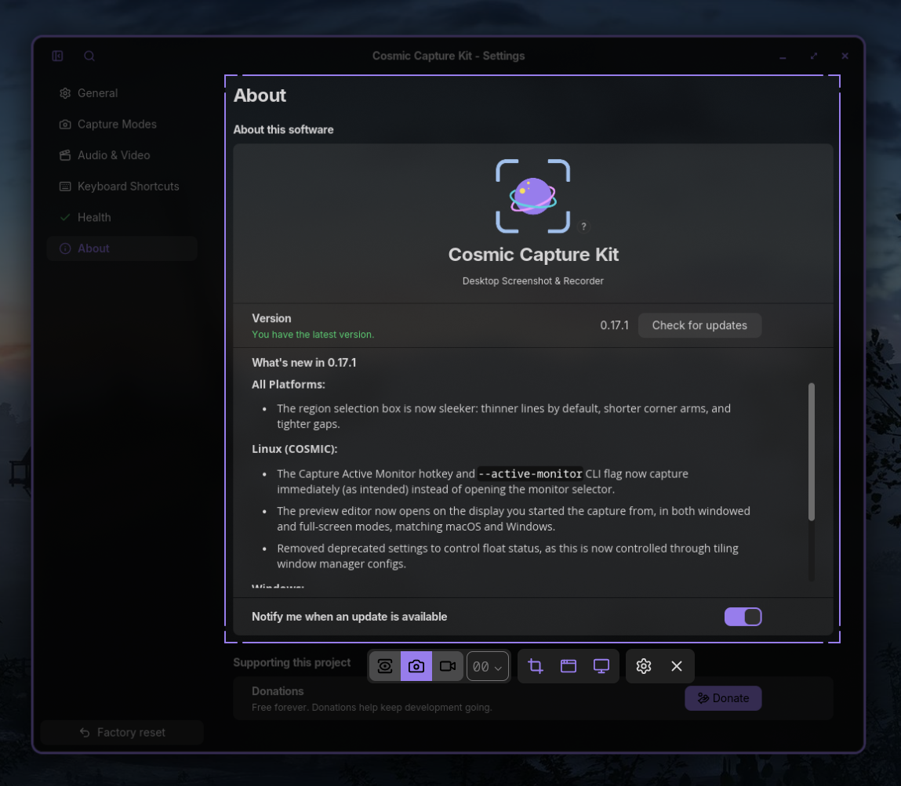
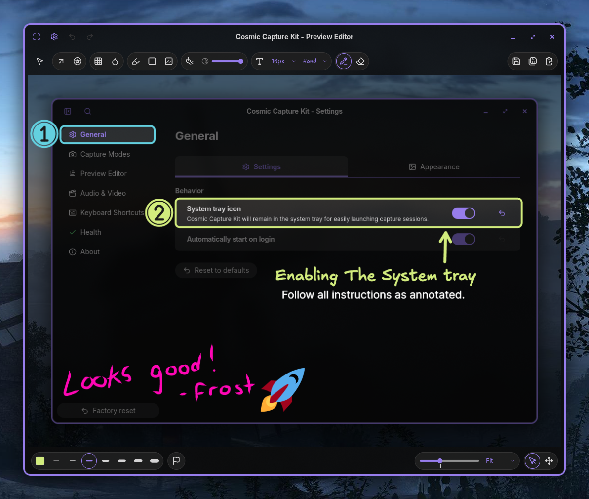

# Cosmic Capture Kit

> [!NOTE]
> Cosmic Capture Kit is currently in the alpha stages. You are free to test this
> software as-is, and scroll below to find planned features and support.





Cross-platform screen region, window, and monitor capture with support for glass
windows, image, video, voice, QR, barcodes, OCR text and more. 

## Current Support Status

| Legend | Meaning          |
| ------ | ---------------- |
| ✅     | Completed        |
| 📅     | Planned          |
| ❓     | To be determined |

### Supported Operating Systems

These are the platforms currently planned for support, along with their current
status.

| Platform                                                 | Capture backend                     | Status  | Notes                                                     |
| -------------------------------------------------------- | ----------------------------------- | ------- | --------------------------------------------------------- |
| macOS 13+ (Apple Silicon)                                | ScreenCaptureKit                    | ✅      |                                                             |
| Windows 11                                               | Windows Capture                     | ✅      |                                                           |
| Windows 10                                               | Windows Capture                     | ✅      | Reported working, but we do not provide official support. |
| Linux (Wayland): COSMIC                                  | Cosmic Compositor / PipeWire Portal | ✅      |                                                           |
| Linux (Wayland): Sway 1.10+ / Hyprland / River (wlroots) | ❓                                  | 📅      |                                                           |
| Linux (Wayland): KDE Plasma                              | ❓                                  | 📅      |                                                           |
| Linux (Wayland): GNOME                                   | ❓                                  | 📅      |                                                           |
| Linux (X11)                                              | ❓                                  | 📅      |                                                           |

### Supported Compositor Extras

These features require platform-specific functionality. One example is on macOS,
where capturing windows with their glass effects is not possible using the
available APIs - clever recompositing tricks are required.

| Platform                                                 | Freeze Pixels for Region Select | Toggle Mouse Cursor | Toggle Window Transparency | Toggle Wallpaper | Single Window Aesthetics (neon border, etc) |
| -------------------------------------------------------- | ------------------------------- | ------------------- | -------------------------- | ---------------- | ------------------------------------------- |
| macOS 13+ (Apple Silicon)                                | ✅                              | ✅                  | ✅                         | ✅               | ✅                                          |
| Windows 11                                               | ✅                              | ✅                  | ✅                         | ✅               | ✅                                          |
| Linux (Wayland): COSMIC                                  | ✅                              | ✅                  | ✅                         | ✅               | ✅                                          |
| Linux (Wayland): Sway 1.10+ / Hyprland / River (wlroots) | 📅                              | 📅                  | 📅                         | 📅               | 📅                                          |
| Linux (Wayland): KDE Plasma                              | 📅                              | 📅                  | 📅                         | 📅               | 📅                                          |
| Linux (Wayland): GNOME                                   | 📅                              | 📅                  | 📅                         | 📅               | 📅                                          |

### Supported Features

These are cross-platform features that are currently planned for the project
along with their statuses.

| Feature                                             | Status  |
| --------------------------------------------------- | ------- |
| Core: Image capture                                 | ✅      |
| Core: Video capture                                 | ✅      |
| Core: Audio capture                                 | ✅      |
| Core: Audio cleanup & mixing pipeline               | ✅      |
| Core: Encoder setup & configuration                 | ✅      |
| Core: Preview editor (windowed)                     | ✅      |
| Core: Preview editor (overlay)                      | ✅      |
| Core: System tray daemon                            | ✅      |
| Preview editor (shared): Clipboard toggle           | ✅      |
| Preview editor (shared): Delete                     | ✅      |
| Preview editor (shared): Save                       | ✅      |
| Preview editor (shared): Save as                    | ✅      |
| Preview editor (shared): Copy                       | ✅      |
| Preview editor (images): Covermarks                 | ✅      |
| Preview editor (images): Color selector             | ✅      |
| Preview editor (images): Arrows                     | ✅      |
| Preview editor (images): Highlighter                | ✅      |
| Preview editor (images): Text w/size                | ✅      |
| Preview editor (images): Step markers               | ✅      |
| Preview editor (images): Dim/spotlight              | ✅      |
| Preview editor (images): Destructive pixelate       | ✅      |
| Preview editor (images): Destructive blur           | ✅      |
| Preview editor (images): Box fill/outline           | ✅      |
| Preview editor (images): Box highlight              | ✅      |
| Preview editor (images): Pencil w/line widths       | ✅      |
| Preview editor (images): Sticker tool               | 📅      |
| Preview editor (images): Eraser tool                | ✅      |
| Preview editor (images): Select/multi-select tool   | ✅      |
| Preview editor (images): Crop tool                  | ✅      |
| Preview editor (videos): Simple cutting tool        | ✅      |
| Preview editor (videos): Simple transition dropdown | ✅      |
| Recording controls: Toggle mic                      | ✅      |
| Recording controls: Toggle speaker                  | ✅      |
| Recording controls: Pause recording                 | ✅      |
| Recording controls: Delete/cancel recording         | ✅      |
| Recording controls: Mouse click effects             | 📅      |
| Recording controls: Keypress overlay                | ❓      |
| Recording controls: Live annotation tools           | ❓      |
| Cloud account support: Proton Drive                 | 📅      |
| Cloud account support: OneDrive                     | 📅      |
| Cloud account support: Google Drive                 | 📅      |
| Cloud account support: Dropbox                      | 📅      |
| Cloud account support: SFTP                         | 📅      |

## Installation

### macOS

1. Download the latest `.dmg` from
   [Releases](https://github.com/Frosthaven/cosmic-capture-kit/releases) and
   drag the app to Applications.
2. First launch: grant Screen Recording (System Settings > Privacy &
   Security), then relaunch. Microphone is optional (for recordings with mic).

### Windows 11

1. Download the latest `.msi` from
   [Releases](https://github.com/Frosthaven/cosmic-capture-kit/releases) and run
   it. It installs per-user (no admin prompt) to
   `%LOCALAPPDATA%\Programs\cosmic-capture-kit`, bundles ffmpeg, and adds Start
   Menu shortcuts (Cosmic Capture Kit, and Cosmic Capture Kit Settings), so
   there is nothing else to install.
2. The installer is not code-signed yet, so on first run SmartScreen may show
   "Windows protected your PC". Click More info, then Run anyway.

### Linux (Wayland): COSMIC

Build from source for now (packaged channels are on the way).

#### Build from source

```sh
git clone https://github.com/Frosthaven/cosmic-capture-kit
cd cosmic-capture-kit
cargo build --release
```

#### Install from source

Install the built binary onto your `PATH` (`~/.cargo/bin`) so shortcuts and the
terminal can launch it by name instead of a full path:

```sh
cargo install --path .
```

#### Shortcuts

Cosmic Capture Kit ships with no keybindings of its own — add your own in
**Settings → Keyboard → Shortcuts → Custom shortcuts**, pointing each at one of
these commands:

| Command                               | Suggested keys           |
| ------------------------------------- | ------------------------ |
| `cosmic-capture-kit --region`         | `Alt+Shift+1`            |
| `cosmic-capture-kit --active-window`  | `Alt+Shift+2`            |
| `cosmic-capture-kit --active-monitor` | `Alt+Shift+3`            |

Add `--no-editor` to any of these for a variant that skips the preview editor — the
capture is saved, copied to the clipboard and notified, with no editor to dismiss. The
notification names what it captured and clicking it opens the folder with the file
selected. Bind both variants of a mode and pick per keypress:

| Command                                             | Suggested keys           |
| --------------------------------------------------- | ------------------------ |
| `cosmic-capture-kit --region --no-editor`           | `Alt+Shift+4`            |
| `cosmic-capture-kit --active-window --no-editor`    | `Alt+Shift+5`            |
| `cosmic-capture-kit --active-monitor --no-editor`   | `Alt+Shift+6`            |

#### Dependencies

| Library     | Required | Notes                                                                           |
| ----------- | -------- | ------------------------------------------------------------------------------- |
| `ffmpeg`    | Yes      | If you have `ffmpeg` 8 headers, you can take advantage of zero-copy recordings. |
| `tesseract` | No       | Enables OCR support in the scanner (don't forget to install a language pack).   |

---

## Tiling window managers

Cosmic Capture Kit makes an effort to play nicely with a few popular tiling
window managers. The overlay tools will bypass tiling, while the preview editor
and the settings window will not by default. You can change the behavior of the
settings window and the preview editor by using the information below.

* Settings window: title `Cosmic Capture Kit - Settings`
* Preview editor window: title `Cosmic Capture Kit - Preview Editor`
* Both share application id `dev.frosthaven.CosmicCaptureKit`

<details>
<summary><b>AeroSpace (macOS)</b></summary>

```
~/.config/aerospace/aerospace.toml
```

```toml
[[on-window-detected]]
if.window-title-regex-substring = 'Cosmic Capture Kit - Settings'
run = ['layout floating']

[[on-window-detected]]
if.window-title-regex-substring = 'Cosmic Capture Kit - Preview Editor'
run = ['layout floating']
```

</details>

<details>
<summary><b>komorebi (Windows)</b></summary>

```
%USERPROFILE%\komorebi.json
```

```json
{
  "floating_applications": [
    { "kind": "Title", "id": "Cosmic Capture Kit - Settings", "matching_strategy": "Equals" },
    { "kind": "Title", "id": "Cosmic Capture Kit - Preview Editor", "matching_strategy": "Equals" }
  ]
}
```

</details>

<details>
<summary><b>COSMIC desktop (Linux)</b></summary>

```
~/.config/cosmic/com.system76.CosmicSettings.WindowRules/v1/tiling_exception_custom
```

```
[
  (enabled: true, appid: "dev.frosthaven.CosmicCaptureKit", title: "Cosmic Capture Kit - Settings"),
  (enabled: true, appid: "dev.frosthaven.CosmicCaptureKit", title: "Cosmic Capture Kit - Preview Editor"),
]
```

</details>

---

## License

The source code in this repository is licensed under [GPL-3.0-only](LICENSE).
The Linux app is free software: use it, build it, share it (it's free forever).
If it's useful to you, donating via [PayPal](https://paypal.me/Frosthaven) will
support future work but is not required.

Official macOS and Windows releases are separately licensed binary builds by the
copyright holder. (The author holds the copyright to all code in this repository
and additionally licenses their own code to themselves for those proprietary
builds; the GPL grant above applies to everyone else and to this repository's
contents.).

## Contributions & Credits

- Icon by [Ashley Ball](https://ashleythedesigner.com/);
- Embedded icon licensing lives in [res/icons/ATTRIBUTION.md](res/icons/ATTRIBUTION.md).
