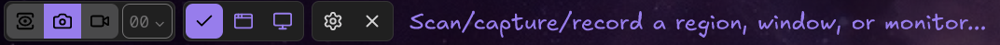

# Cosmic Capture Kit

> [!NOTE]
> Cosmic Capture Kit is currently in the alpha stages. You are free to test this
> software as-is, and scroll below to find planned features and support.




Cross-platform screen region, window, and monitor capture with support for
translucent windows, image, video, voice, QR, barcodes, OCR text, and
annotation.

## 📊 Current Support Status

### Supported Platforms

**Legend:** ✅ supported · 🟡 partial · ❌ not supported · 📅 planned · ❓ unknown until built

| Platform                  | Compositor                                  | Common distros                       | Capture method           | Core features | Capture extras | Window aesthetics |
| ------------------------- | ------------------------------------------- | ------------------------------------ | ------------------------ | ------------- | -------------- | ----------------- |
| macOS 14+ (Apple Silicon) | Quartz Compositor                           | macOS                                | ScreenCaptureKit         | ✅            | ✅             | ✅                |
| Windows 10, 11 (x86_64)   | Desktop Window Manager                      | Windows                              | Windows Graphics Capture | ✅            | ✅             | ✅                |
| Linux, Wayland            | cosmic-comp (COSMIC)                        | Pop!_OS                              | screencopy / portal      | ✅            | ✅             | ✅                |
| Linux, Wayland            | KWin 6.6+ (KDE Plasma)                      | Kubuntu, Fedora KDE, SteamOS Desktop | screencopy / portal      | 📅            | ❓             | ❓                |
| Linux, Wayland            | Mutter 49.2+ (GNOME)                        | Ubuntu, Fedora, Debian               | screencopy / portal      | 📅            | ❓             | ❓                |
| Linux, Wayland            | Muffin 6.6+ (Cinnamon)                      | Linux Mint                           | screencopy / portal      | 📅            | ❓             | ❓                |
| Linux, Wayland            | Hyprland 0.52+                              | *user installed*                     | screencopy / portal      | 📅            | ❓             | ❓                |
| Linux, Wayland            | niri 25.11+                                 | *user installed*                     | screencopy / portal      | 📅            | ❓             | ❓                |
| Linux, Wayland            | wlroots 0.19+ (Sway, river, Wayfire, labwc) | *user installed*                     | screencopy / portal      | 📅            | ❓             | ❓                |
| Linux, X11                | any window manager                          | Mint MATE / Xfce, older releases     | X11 XShm                 | 📅            | ❓             | ❓                |

<details>
<summary>What these columns mean, and what's required</summary>

Sway, river, Wayfire and labwc share a row because they are all built on
wlroots, which implements these protocols on their behalf. Each version above is
simply that compositor's first release carrying wlroots 0.19 or newer, which is
where the capture protocols landed. Hyprland and niri implement their own
protocol support (on Aquamarine and Smithay respectively), so they get their own
rows.

**Capture extras** are the four capture-time options: freeze pixels during
selection, preserve mouse cursor, preserve window transparency, and preserve
wallpaper. Some of them need platform-specific functionality: on macOS, for
example, capturing windows with their glass effects is not possible through the
available APIs, so clever recompositing is required.

**Window aesthetics** is the border, shadow, rounding and padding applied to a
captured single window.

Whatever your own system supports is reported under Settings -> Health.

On Linux the two capture methods are **Compositor screencopy**, which reads
frames straight from the compositor, and the **PipeWire portal**, which asks
permission through a system dialog. Both appear in Settings under Capture
method; the version floors above are where each compositor gained the protocols
screencopy needs.

On X11 there is no single capture API. A backend there would combine XShm for
full-screen grabs, XComposite for per-window pixels, XFixes for the cursor,
EWMH window properties for the window list, and ffmpeg's x11grab for recording.

X11 applications running inside a Wayland session capture normally: they are
ordinary windows to the compositor.

Recording needs ffmpeg, and audio capture on Linux needs a Pulse-compatible
server. See [dependencies.md](dependencies.md) for the full list and what
happens when a piece is missing.

</details>

### Supported Features

These are cross-platform features that are currently planned for the project
along with their statuses.

**Legend:** ✅ done · 📅 planned · ❓ under consideration

<details>
<summary><b>Core</b></summary>

| Feature                         | Status |
| ------------------------------- | ------ |
| Image capture                   | ✅     |
| Video capture                   | ✅     |
| Audio capture                   | ✅     |
| Audio cleanup & mixing pipeline | ✅     |
| Encoder setup & configuration   | ✅     |
| Preview editor (windowed)       | ✅     |
| Preview editor (overlay)        | ✅     |
| System tray daemon              | ✅     |

</details>

<details>
<summary><b>Image Preview Editor</b></summary>

| Feature                   | Status |
| ------------------------- | ------ |
| Covermarks                | ✅     |
| Color selector            | ✅     |
| Arrows                    | ✅     |
| Highlighter               | ✅     |
| Text w/size               | ✅     |
| Step markers              | ✅     |
| Dim/spotlight             | ✅     |
| Destructive pixelate      | ✅     |
| Destructive blur          | ✅     |
| Box outline               | ✅     |
| Box fill                  | 📅     |
| Box highlight             | ✅     |
| Pencil w/line widths      | ✅     |
| Sticker tool              | 📅     |
| Eraser tool               | ✅     |
| Select/multi-select tool  | ✅     |
| Crop tool                 | ✅     |
| Automatic clipboard copy  | ✅     |
| Save (choose where)       | ✅     |
| Copy to clipboard         | ✅     |
| Share sheet (Windows)     | ✅     |
| Share sheet (macOS)       | ✅     |
| Upload to a cloud account | ✅     |

</details>

<details>
<summary><b>Video Preview Editor</b></summary>

| Feature                    | Status |
| -------------------------- | ------ |
| Simple cutting tool        | ✅     |
| Simple transition dropdown | 📅     |
| Automatic clipboard copy   | ✅     |
| Save (choose where)        | ✅     |
| Copy to clipboard          | ✅     |
| Share sheet (Windows)      | ✅     |
| Share sheet (macOS)        | ✅     |
| Upload to a cloud account  | ✅     |

</details>

<details>
<summary><b>Recording Controls</b></summary>

| Feature                 | Status |
| ----------------------- | ------ |
| Toggle mic              | ✅     |
| Toggle speaker          | ✅     |
| Pause recording         | ✅     |
| Delete/cancel recording | ✅     |
| Mouse click effects     | 📅     |
| Keypress overlay        | ❓     |
| Live annotation tools   | ❓     |

</details>

<details>
<summary><b>Cloud Accounts</b></summary>

| Feature      | Status |
| ------------ | ------ |
| Dropbox      | ✅     |
| Google Drive | ✅     |
| iCloud Drive | 📅     |
| OneDrive     | ✅     |
| Proton Drive | ✅     |
| SFTP         | 📅     |
| YouTube      | ✅     |

</details>

## 📦 Installation

<details>
<summary><b>macOS</b></summary>

1. Download the latest `CosmicCaptureKit-<version>-aarch64.dmg` from
   [Releases](https://github.com/Frosthaven/cosmic-capture-kit/releases) and
   drag the app to Applications. Apple Silicon only.
2. First launch: grant Screen Recording (System Settings > Privacy &
   Security), then relaunch. Microphone is optional (for recordings with mic).

</details>

<details>
<summary><b>Windows 11</b></summary>

1. Download the latest `CosmicCaptureKit-<version>-x86_64.msi` from
   [Releases](https://github.com/Frosthaven/cosmic-capture-kit/releases) and run
   it (x86_64 only). It installs per-user (no admin prompt) to
   `%LOCALAPPDATA%\Programs\cosmic-capture-kit`, bundles ffmpeg, and adds Start
   Menu shortcuts (Cosmic Capture Kit, and Cosmic Capture Kit Settings), so
   there is nothing else to install.
2. The installer is not code-signed yet, so on first run SmartScreen may show
   "Windows protected your PC". Click More info, then Run anyway.

</details>

<details>
<summary><b>Linux (Wayland): COSMIC</b></summary>

There are two routes: download the release build, which is the quickest, or
build from source, which works on any distro and is the only route on
architectures other than x86_64.

#### Download the release build

1. Download `CosmicCaptureKit-<version>-x86_64-COSMIC.zip` from
   [Releases](https://github.com/Frosthaven/cosmic-capture-kit/releases).
2. Unzip it and put the binary on your `PATH`:

   ```sh
   unzip CosmicCaptureKit-*-x86_64-COSMIC.zip
   chmod +x cosmic-capture-kit
   mkdir -p ~/.local/bin && mv cosmic-capture-kit ~/.local/bin/
   ```

   If your shell cannot find it afterwards, `~/.local/bin` is not on your
   `PATH` yet.
3. Run `cosmic-capture-kit --settings` to look around and set your save
   folders, then bind the [shortcuts](#shortcuts) below.

The zip holds one binary and nothing else. It is x86_64 only and needs glibc
2.39 or newer, so Arch, CachyOS, Fedora 40+, Ubuntu 24.04+, Pop!_OS 24.04 and
Debian 13 all run it, while Ubuntu 22.04, Mint 21 and Debian 12 do not. It also
links libxkbcommon, libpulse and libpipewire, which a COSMIC desktop already
has. On an older distro, build from source instead.

Cloud uploads need no setup in this build: the provider registrations are
already compiled in. A build from source does not have them, and needs one
one-time step per provider.

To get an entry in the application menu, install the shipped desktop file as
described under [Install from source](#install-from-source).

#### Build dependencies

The binary links libxkbcommon, libpulse and libpipewire, so their development
packages have to be installed before the first build. A desktop system has the
runtime libraries already but usually not the dev packages.

```sh
# Arch / CachyOS
sudo pacman -S base-devel clang libxkbcommon libpulse libpipewire

# Debian / Ubuntu / Linux Mint / Pop!_OS
sudo apt install build-essential pkg-config libclang-dev \
                 libxkbcommon-dev libpulse-dev libpipewire-0.3-dev
```

See [dependencies.md](dependencies.md) for what each one is for, plus the
runtime extras (ffmpeg for recording, tesseract for OCR).

#### Build from source

```sh
git clone https://github.com/Frosthaven/cosmic-capture-kit
cd cosmic-capture-kit
cargo build --release
```

**On Debian, Ubuntu, Mint and Pop!_OS, add `--no-default-features` to every
cargo command**, including `test`, `run` and `install`:

```sh
cargo build --release --no-default-features
```

Those distros ship an older ffmpeg (Ubuntu 24.04, and so Mint 22, has 6.1.1),
while the default `zero-copy` feature needs ffmpeg 8 headers, so the build
otherwise stops inside `ffmpeg-sys-next`. The only thing dropped is the
in-process GPU zero-copy encoding path. Recording still works through the
`ffmpeg` binary.

With [`just`](https://github.com/casey/just) installed, `just build`
does the same build (and, on Linux, automatically retries with
`--no-default-features` if the first attempt fails). The same command also
works on macOS and Windows, each building that platform's own local
packaged artifact.

#### Run it

The build puts the binary at `target/release/cosmic-capture-kit`, inside the
folder you cloned into. There is no app window to open and nothing is added to
your application menu by building: Cosmic Capture Kit is a one-shot tool. It
launches straight into a capture, does the job, and exits.

```sh
./target/release/cosmic-capture-kit             # region screenshot (a bare launch)
./target/release/cosmic-capture-kit --settings  # the settings window, no capture
./target/release/cosmic-capture-kit --help      # every flag
```

Start with `--settings` to look around and set your save folders. A bare launch
immediately dims the screen for a region selection, which is surprising the
first time if you were expecting a normal application window.

See [CLI.md](CLI.md) for the full flag list.

Want to upload captures straight to Google Drive, OneDrive, Dropbox, YouTube or
Proton Drive? A build made from source needs one extra, one-time setup step per
provider, and Proton Drive needs one on every build (it connects through
Proton's own free command-line tool rather than through an app registration).
See [CLOUD_ACCOUNTS.md](CLOUD_ACCOUNTS.md) for plain, step-by-step
instructions.

#### Install from source

Install the built binary onto your `PATH` (`~/.cargo/bin`) so shortcuts and the
terminal can launch it by name instead of a full path:

```sh
cargo install --path .
```

On Debian, Ubuntu, Mint and Pop!_OS this needs the same flag as the build:
`cargo install --path . --no-default-features`.

Once installed, the commands above become `cosmic-capture-kit`,
`cosmic-capture-kit --settings`, and so on, from any directory. That is also the
form the keyboard shortcuts below expect. If your shell cannot find it, make
sure `~/.cargo/bin` is on your `PATH`.

To get an entry in the application menu, install the shipped desktop file and
its icon. Do this after `cargo install`, because the entry launches the binary
by name and so needs it on your `PATH`:

```sh
install -Dm644 res/dev.frosthaven.CosmicCaptureKit.desktop \
  ~/.local/share/applications/dev.frosthaven.CosmicCaptureKit.desktop
install -Dm644 res/icons/dev.frosthaven.CosmicCaptureKit.svg \
  ~/.local/share/icons/hicolor/scalable/apps/dev.frosthaven.CosmicCaptureKit.svg
```

Launching from the menu is a bare launch, so it starts a region screenshot.
Installing the entry is worth doing anyway: it is what makes the desktop and
xdg-desktop-portal show the app's real name instead of a generic fallback.

#### Shortcuts

Cosmic Capture Kit ships with no keybindings of its own. Add your own in
**Settings → Keyboard → Shortcuts → Custom shortcuts**.

**One key is enough.** A bare launch opens the capture overlay, and the overlay
is the whole tool. Its toolbar switches between region, window and monitor
without relaunching, and it also carries the screenshot / recording / scan
choice, the countdown, and the capture toggles. Pressing the active selector is
what takes the capture.

| Command              | Suggested keys |
| -------------------- | -------------- |
| `cosmic-capture-kit` | `Print`        |

With a region drawn, `Ctrl+C` copies it to the clipboard without opening the
editor.

The rest are for landing somewhere directly, if you would rather skip the
toolbar for a mode you use constantly:

| Command                               | What it does                                    | Suggested keys |
| ------------------------------------- | ----------------------------------------------- | -------------- |
| `cosmic-capture-kit --region`         | The overlay, region selected (same as bare)      | `Alt+Shift+1`  |
| `cosmic-capture-kit --window`         | The overlay, window selected                     | `Alt+Shift+2`  |
| `cosmic-capture-kit --monitor`        | The overlay, monitor selected                    | `Alt+Shift+3`  |
| `cosmic-capture-kit --active-window`  | Captures the active window at once, no overlay   | `Alt+Shift+4`  |
| `cosmic-capture-kit --active-monitor` | Captures the monitor under the cursor, no overlay | `Alt+Shift+5` |

Add `--no-editor` to any of these for a variant that skips the preview editor:
the capture is saved, copied to the clipboard and notified, with no editor to
dismiss. The notification names what it captured, and clicking it opens the
folder with the file selected. Bind both variants of a mode and pick per
keypress:

| Command                                           | Suggested keys |
| ------------------------------------------------- | -------------- |
| `cosmic-capture-kit --no-editor`                  | `Alt+Shift+6`  |
| `cosmic-capture-kit --active-window --no-editor`  | `Alt+Shift+7`  |
| `cosmic-capture-kit --active-monitor --no-editor` | `Alt+Shift+8`  |

See [CLI.md](CLI.md) for every flag, including `--video`, `--scan` and
`--countdown`.

#### Dependencies

| Library     | Required | Notes                                                                           |
| ----------- | -------- | ------------------------------------------------------------------------------- |
| `ffmpeg`    | Yes      | If you have `ffmpeg` 8 headers, you can take advantage of zero-copy recordings. |
| `tesseract` | No       | Enables OCR support in the scanner (don't forget to install a language pack).   |

</details>

---

## 🧩 Tiling window managers

Cosmic Capture Kit makes an effort to play nicely with popular tiling window
managers. The overlay tools will bypass tiling, while the preview editor and the
settings window will not by default. You can change the behavior of the settings
window and the preview editor by using the information below.

* Settings window: title `Cosmic Capture Kit - Settings`
* Preview editor window: title `Cosmic Capture Kit - Preview Editor`
* Both share application id `dev.frosthaven.CosmicCaptureKit`

Each snippet below is an addition to your existing config, not a replacement
for it.

### macOS

<details>
<summary><b>AeroSpace</b></summary>

```
~/.config/aerospace/aerospace.toml
```

```toml
[[on-window-detected]]
if.window-title-regex-substring = 'Cosmic Capture Kit - Settings'
run = ['layout floating']

[[on-window-detected]]
if.window-title-regex-substring = 'Cosmic Capture Kit - Preview Editor'
run = ['layout floating']
```

Reload with `aerospace reload-config`. The match is an unanchored, case
insensitive substring.

</details>

<details>
<summary><b>yabai</b></summary>

```
~/.config/yabai/yabairc
```

```sh
yabai -m rule --add app="^Cosmic Capture Kit$" title="^Cosmic Capture Kit - Settings$" manage=off
yabai -m rule --add app="^Cosmic Capture Kit$" title="^Cosmic Capture Kit - Preview Editor$" manage=off
```

The regex is POSIX extended and unanchored, hence the `^` and `$`. `app` matches
the application name, not the bundle id. Rules apply to windows opened
afterwards, so run `yabai -m rule --apply` to catch windows that are already
open. `manage` needs no SIP changes.

</details>

### Windows

<details>
<summary><b>GlazeWM</b></summary>

```
%USERPROFILE%\.glzr\glazewm\config.yaml
```

```yaml
window_rules:
  - commands: ["set-floating"]
    match:
      - window_title: { equals: "Cosmic Capture Kit - Settings" }
      - window_title: { equals: "Cosmic Capture Kit - Preview Editor" }
```

This is the v3 config format. Reload with `wm-reload-config` (`alt+shift+r` by
default). Each `- ` entry under `match` is an alternative, so the two titles are
an either/or.

</details>

<details>
<summary><b>komorebi</b></summary>

```
%USERPROFILE%\komorebi.json
```

Merge this key into your existing `komorebi.json`; it is not the whole file:

```json
{
  "floating_applications": [
    { "kind": "Title", "id": "Cosmic Capture Kit - Settings", "matching_strategy": "Equals" },
    { "kind": "Title", "id": "Cosmic Capture Kit - Preview Editor", "matching_strategy": "Equals" }
  ]
}
```

Apply it with `komorebic replace-configuration <path>`. Note that
`komorebic reload-configuration` is for the legacy `komorebi.ahk` and
`komorebi.ps1` configs and will not pick this up.

</details>

### Linux

<details>
<summary><b>COSMIC desktop</b></summary>

```
~/.config/cosmic/com.system76.CosmicSettings.WindowRules/v1/tiling_exception_custom
```

```
[
  (enabled: true, appid: "dev.frosthaven.CosmicCaptureKit", title: "Cosmic Capture Kit - Settings"),
  (enabled: true, appid: "dev.frosthaven.CosmicCaptureKit", title: "Cosmic Capture Kit - Preview Editor"),
]
```

All three fields are required. No compositor restart is needed, but the rule is
read when a window opens, so reopen the window rather than restarting. Do not
hand-edit this file while the Settings app is open, since it will write over you.

</details>

<details>
<summary><b>Hyprland</b></summary>

Hyprland changed its config language in 0.55, so which snippet you want depends
on your version. Check with `hyprctl version`.

**0.55 and newer**, `~/.config/hypr/hyprland.lua`:

```lua
hl.window_rule({
  match = { title = "Cosmic Capture Kit - Settings" },
  float = true,
})

hl.window_rule({
  match = { title = "Cosmic Capture Kit - Preview Editor" },
  float = true,
})
```

**0.52 and older**, `~/.config/hypr/hyprland.conf`:

```
windowrule = float, title:Cosmic Capture Kit - Settings
windowrule = float, title:Cosmic Capture Kit - Preview Editor
```

0.53 and 0.54 use an intermediate form; the 0.54 wiki has it. Matching is RE2
whole-string, so these patterns are already exact and a substring match would
need explicit `.*` at both ends. One caveat worth knowing: `float` is applied
when the window opens and reads its INITIAL title, so if a rule ever stops
firing, match `class:dev\.frosthaven\.CosmicCaptureKit` instead.

</details>

<details>
<summary><b>niri</b></summary>

```
~/.config/niri/config.kdl
```

```kdl
window-rule {
    match title=r#"^Cosmic Capture Kit - Settings$"#
    match title=r#"^Cosmic Capture Kit - Preview Editor$"#
    open-floating true
}
```

`open-floating` needs niri 25.01 or newer. Multiple `match` directives are an
either/or. Matching is unanchored, hence the `^` and `$`, and the KDL raw string
(`r#"..."#`) is what keeps a backslash intact if you add one. The config
live-reloads on save.

</details>

<details>
<summary><b>river</b></summary>

river 0.4 removed its built-in window manager, so there is no rule to write in
river itself any more: floating behavior belongs to whichever third-party window
manager you run on top of it, and each has its own config.

On **river-classic** (the maintained 0.3.x line), in `~/.config/river/init`,
which must be executable:

```sh
riverctl rule-add -title 'Cosmic Capture Kit - Settings' float
riverctl rule-add -title 'Cosmic Capture Kit - Preview Editor' float
```

Matching here is glob, not regex, so there is no alternation and each title needs
its own rule. The rules apply to windows opened after they are added, and
`riverctl list-rules float` prints what is active.

</details>

<details>
<summary><b>Sway</b></summary>

```
~/.config/sway/config
```

```
for_window [title="^Cosmic Capture Kit - Settings$"] floating enable
for_window [title="^Cosmic Capture Kit - Preview Editor$"] floating enable
```

Criteria are PCRE2 and unanchored, so the `^` and `$` are doing real work.
`for_window` only affects windows opened after the rule exists, so reload with
`swaymsg reload` and reopen the window.

</details>

<details>
<summary><b>Wayfire</b></summary>

```
~/.config/wayfire.ini
```

Wayfire stacks by default and only tiles if the `simple-tile` plugin is enabled,
so if you are not running that plugin there is nothing to do. If you are, the
opt-out goes through the plugin rather than through `window-rules`, which has no
float action at all:

```ini
[simple-tile]
tile_by_default = !((title is "Cosmic Capture Kit - Settings") | (title is "Cosmic Capture Kit - Preview Editor"))
```

Criteria here are not regex: `is` is exact and `contains` is a substring.
Combining more than two needs explicit parentheses, since the operators have no
precedence order.

</details>

---

## ⚖️ License

The source code in this repository is licensed under [GPL-3.0-only](LICENSE).
The Linux app is free software: use it, build it, share it (it's free forever).
If it's useful to you, donating via [PayPal](https://paypal.me/Frosthaven) will
support future work but is not required.

Official macOS and Windows releases are separately licensed binary builds by the
copyright holder. (The author holds the copyright to all code in this repository
and additionally licenses their own code to themselves for those proprietary
builds; the GPL grant above applies to everyone else and to this repository's
contents.).

## 🙏 Contributions & Credits

- Brand icon by [Ashley Ball](https://ashleythedesigner.com/).
- UI icons from [Lucide](https://lucide.dev) (ISC). The cloud provider marks are
  each provider's own. Details in
  [res/icons/ATTRIBUTION.md](res/icons/ATTRIBUTION.md).
